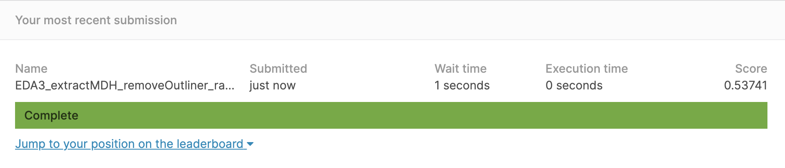

# [Group9] Bike Sharing Demand

### Groups
* 王靖文, 105703057
* 鄭以湉, 106304003
* 黃大瑋, 107207438

### Goal
Our goal is to forecast bike rental demand in the Capital Bikeshare program in Washington, D.C. based on different conditions. 
### Demo 
You should provide an example commend to reproduce your result
```R
Rscript code/data_science_final.R
```
* any on-line visualization


## Folder organization and its related information

### docs
* Your presentation, 1101_datascience_FP_<yourID|groupName>.ppt/pptx/pdf, by **Jan. 13**
* Any related document for the final project
  * papers
  * software user guide

### data

* Source
  * https://www.kaggle.com/c/bike-sharing-demand/data
* Input format
  * CSV file
* Any preprocessing?
  1. 

### code

* Which method do you use?
  * Lasso, Xgboost, Random Forest
* What is a null model for comparison?
  * Our null model is the mean of the count from training data.
* How do your perform evaluation? ie. cross-validation, or addtional indepedent data set
  * We apply cross-validation to get optimal hyperparameters and then add into training process.

### results

* Which metric do you use 
  * Root Mean Squared Logarithmic Error(RMSLE)
* Is your improvement significant?
  * yes, we create some versions of training data based on different methods of data cleaning, and the testing RMSLE decreases significantly after training the models by using those versions of training data 
* What is the challenge part of your project?
  * data cleaning
## References
* Code/implementation which you include/reference (__You should indicate in your presentation if you use code for others. Otherwise, cheating will result in 0 score for final project.__)
* Packages you use
  * library(lubridate)
  * library(randomForest)
  * library(glmnet)
  * library(ModelMetrics)
  * ibrary(xgboost)
* Related publications
